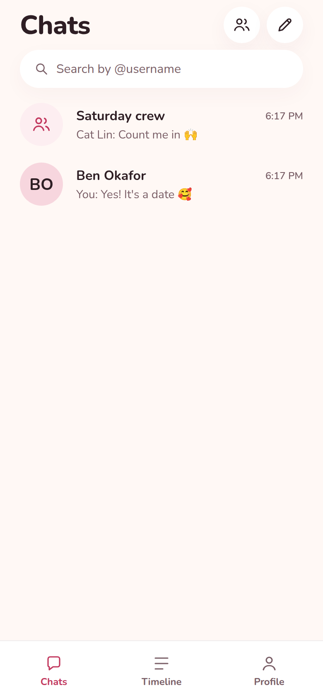
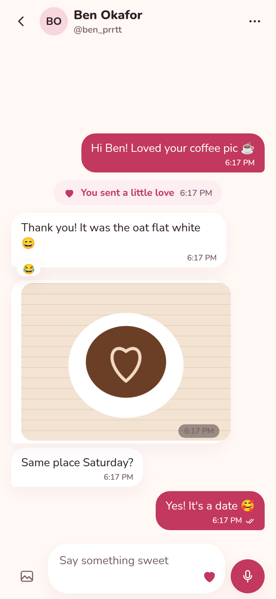
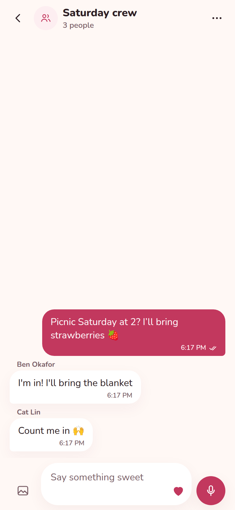
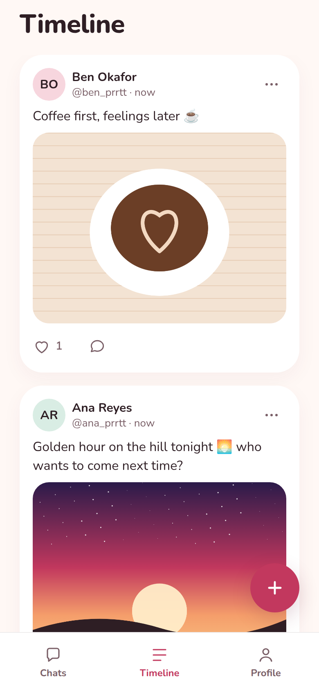

# Realme

An end-to-end encrypted messenger with a public timeline. Find people by
@username, chat one-on-one or in groups (photos, voice notes, reactions, a
"thinking of you" heart), and share moments on the timeline.

<p>
  
  
  
  
</p>

All screens: [`docs/screenshots/`](docs/screenshots).

```
apps/mobile      Expo (React Native) app — iOS & Android
apps/server      Hono API + WebSocket server on Postgres (Neon)
packages/crypto  End-to-end encryption shared by both (libsodium)
```

## Features

- **@usernames** — search for anyone by username or name; no invite codes.
- **Chats** — one-on-one and groups (up to 64), typing indicators, read
  receipts, reactions, photos, voice notes, retries that never double-send.
- **Message requests** — a first message from someone you don't chat with
  lands in Requests. They can't tell you've seen it until you accept.
- **Groups** — description, several admins, "only admins can send" and "only
  admins can edit info" settings, searchable member list, and a history of
  changes shown in the chat ("Ana added Ben"). Leaving hands admin to someone
  else; the last person out deletes the group and its media.
- **Status** — text or photo updates that disappear after 24 hours, shown to
  people you have an accepted chat with. End-to-end encrypted; you see who viewed.
- **Calls** — one-to-one voice and video calls (WebRTC) from a chat, contact
  info or the Calls tab, with history (missed, declined, duration).
- **Channels** — public one-way broadcasts in the Updates tab: anyone can find
  and follow a channel; the owner posts text and photos; followers react.
- **Communities** — groups under one roof with an announcements chat only
  admins post to. Members join any group in the community themselves; leaving
  the community leaves all of its groups.
- **Timeline** — public posts with an optional photo, likes and comments.
- **Settings & dark mode** — system / light / dark, read-receipt privacy,
  notification and account settings.
- **Safety** — block (both directions: no chats, no group adds, hidden from
  search, profiles and the timeline) and report people, posts, comments or chats.

## How the encryption works

- **Keys live on the phones.** Each account has an X25519 key pair generated on
  the device; the secret key stays in the iOS Keychain / Android Keystore.
- **Messages** get a fresh random key each. The message is encrypted with it
  (XChaCha20-Poly1305), and the key is sealed separately for every member with
  `crypto_box`, bound to a hash of the ciphertext. So:
  - only people who were members when it was sent can read it;
  - the server and other members can't forge a message in someone's name or
    swap one message's content for another's;
  - the chat id and sender are sealed inside, so a message can't be moved
    between chats or relabelled.
- **Photos and voice notes** in chats are encrypted on the phone with their own
  key, which travels inside the encrypted message.
- **Status updates** are encrypted the same way, sealed for you plus each
  contact at the moment you post. Someone you chat with later won't see it.
- **Calls** are peer-to-peer WebRTC: media is encrypted with DTLS-SRTP keys
  the two phones agree on. The offer/answer that carries those keys' fingerprints
  is itself sealed with both people's account keys (same scheme as messages), so
  the server — which only relays it — can't slip its own keys in. A TURN relay
  only ever sees encrypted media.
- **The password never leaves the phone.** It's stretched with Argon2id into
  two secrets: one logs in (the server stores only an Argon2 hash of it), the
  other wraps a backup of the secret key — so signing in on a new phone
  restores your key and history.
- **Safety number.** Chat info shows a number derived from both people's keys.
  If it matches on both phones, the server hasn't swapped in its own key.

**Not encrypted (by design):** timeline posts, comments, post photos and
channels (posts, photos, reactions) are public. Community chats are ordinary
encrypted groups. The server also sees usernames, who is in which chat, group names,
group descriptions and history, message timestamps and sizes, who called whom and for how long, read receipts, typing, who viewed a status, and reports.

**Known limitations:**

- No forward secrecy — a leaked secret key exposes past messages. A
  double-ratchet / MLS protocol would fix this.
- One device key per account (signing in elsewhere reuses it).
- Forgetting your password loses your chat history (nobody else holds the key).
- Reports of encrypted chats only include what the reporter chooses to paste;
  there is no moderation dashboard yet (reports are stored in the `reports` table).
- Real-time delivery is single-instance (in-memory hub). Running more than one
  server needs shared pub/sub (Postgres `LISTEN/NOTIFY` on a direct Neon
  connection, or Redis).

## Running it

Requirements: Node 22+, a Neon (or any Postgres) database, and for media an
S3-compatible bucket such as Cloudflare R2.

```bash
npm install

# Server
cp apps/server/.env.example apps/server/.env    # fill in DATABASE_URL, JWT_SECRET, S3_*
cd apps/server
npm run db:migrate
npm run dev
```

No bucket yet? Leave the `S3_*` lines out and set `STORAGE_DIR=./.media` and
`PUBLIC_URL=http://<your-computer's-LAN-IP>:8787` — the server then stores media
on disk. Development only.

```bash
# App
cp apps/mobile/.env.example apps/mobile/.env    # EXPO_PUBLIC_API_URL
cd apps/mobile
npx expo run:ios      # or run:android
```

The app uses native modules (libsodium, secure storage), so it needs a
**development build** — it won't run in Expo Go. Without Xcode/Android Studio,
use EAS: `npx eas-cli@latest build --profile development`. Push notifications
need an EAS project id (`npx eas-cli@latest init`).

### Deploying the server (Railway)

`railway.json` builds `apps/server/Dockerfile` (server dependencies only) and
runs `npm run migrate` before each deploy. Set `DATABASE_URL` (Neon pooled
string), `JWT_SECRET`, and the `S3_*` variables (a Railway bucket works) on the
service, then point the app's `EXPO_PUBLIC_API_URL` at the service's domain.

**Calls** need a TURN server in production — many mobile networks block direct
peer-to-peer connections. Run [coturn](https://github.com/coturn/coturn) with
`use-auth-secret` and `static-auth-secret=<secret>`, then set on the server:

```bash
TURN_URLS=turn:turn.example.com:3478?transport=udp,turns:turn.example.com:5349
TURN_SECRET=<the same secret>   # phones get short-lived per-user credentials
# STUN_URLS defaults to Google's public STUN server
```

Calls use `react-native-webrtc`, so they also need the development build.
Incoming calls ring while the app is open; when it's closed they arrive as a
push notification ("📞 Incoming call") — there's no CallKit / ConnectionService
full-screen ringing yet, and group calls aren't supported.

The web target (`npx expo start --web`, with `CORS_ORIGIN` set on the server)
works as a development preview; keys are kept in `sessionStorage` there, so
don't treat it as secure.

## Tests

```bash
npm test          # crypto unit tests + API tests against in-memory Postgres
npm run typecheck
```

## Design

"Soft & romantic": warm cream canvas, rose accent (`#C2385E`), plum-brown ink,
Nunito type, diffused shadows and spring-based motion. Tokens live in
`apps/mobile/src/theme.ts`; every text/background pair meets WCAG AA.
